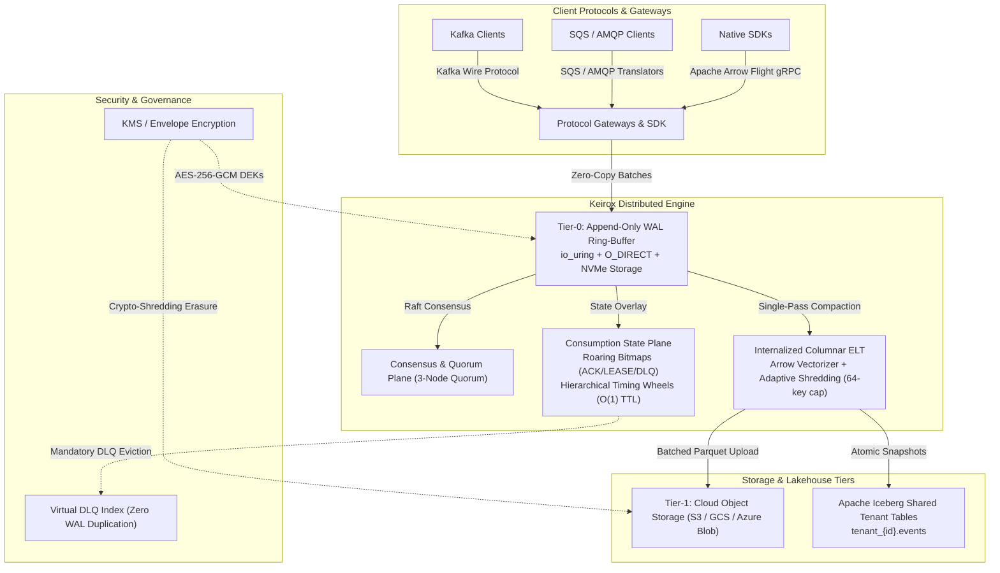

<div align="center">

# Keirox: The Polymorphic Event Fabric (PEF)

**Next-Generation Unified Distributed Streaming, Task Queuing, and Columnar Lakehouse Runtime**

[](LICENSE)
[](https://www.rust-lang.org/)
[](docs/architecture/)
[-blueviolet.svg)](docs/architecture/KEI-ARC-011.md)
[](docs/architecture/KEI-VAL-050.md)

</div>

---

## 🚀 Overview

**Keirox** is an open-source, high-performance distributed runtime implementing the **Polymorphic Event Fabric (PEF)**. 

Modern data architectures are burdened by fragmentation: engineering teams deploy separate broker clusters for **event streaming** (e.g., Apache Kafka), **message queuing / task distribution** (e.g., RabbitMQ, Amazon SQS), and **lakehouse ingestion pipelines** (e.g., Spark/Flink connectors writing to Apache Iceberg or Delta Lake). This causes massive operational overhead, infrastructure redundancy, dual-write bugs, and high egress costs.

Keirox eliminates this fragmentation by introducing a unified storage and state engine governed by the **Golden Invariant**:

> **$$\text{The Golden Invariant}$$**
> $$\text{Data is written exactly once to an immutable physical log.}$$
> $$\text{Consumption semantics (streaming, queuing, dead-lettering, lakehouse analytics) are defined}$$
> $$\text{entirely by the consumer's mutable, replicated state overlay.}$$



---

## 📁 Repository Layout

```text
keirox/
├── Cargo.toml                  # Virtual workspace configuration
├── README.md                   # Repository overview & quick start
├── CONTRIBUTING.md             # Development standards & zero-allocation rules
├── AGENTS.md                   # AI Agent governance & zero-divergence protocol
├── LICENSE                     # Apache License 2.0
├── docs/                       # Formal engineering documentation suite
│   ├── architecture/           # 25 certified architecture specifications (L0–L3)
│   ├── engineering/            # Implementation RFCs and design guides
│   ├── benchmarks/             # Benchmark plans, methodology, and raw results
│   ├── reports/                # Certification audits and verification reports
│   └── archive/                # Non-authoritative historical concept drafts
├── crates/                     # Modular Rust workspace crates
│   ├── keirox-core/            # Domain models, identifiers, errors, and invariants
│   ├── keirox-wal/             # io_uring + O_DIRECT WAL engine & CRC32C framing
│   ├── keirox-index/           # Packed 32-byte stream registry & SSTable indexes
│   ├── keirox-state/           # Roaring Bitmap state overlay & sliding watermarks
│   ├── keirox-timer/           # Hierarchical Timing Wheel for O(1) lease TTL
│   ├── keirox-arena/           # Lock-free pre-allocated row arenas for hot ingress
│   ├── keirox-arrow-elt/       # Arrow vectorizer, adaptive shredder & Iceberg committer
│   ├── keirox-api/             # Protobuf RPC schemas & gateway protocol definitions
│   ├── keirox-server/          # Distributed runtime daemon & CLI binary
│   ├── keirox-bench/           # Canonical benchmark harness (P1–P6 workloads)
│   ├── keirox-chaos/           # Chaos engineering fault injection & Jepsen test suite
│   └── keirox-testkit/         # Test fixtures, mock storage & deterministic clocks
├── scripts/                    # Build, formatting, and CI automation scripts
├── deploy/                     # Dockerfiles, Kubernetes manifests & Helm charts
└── tests/                      # End-to-end and verification test suites
    ├── integration/            # Multi-crate integration & gateway compatibility
    ├── golden/                 # Byte-for-byte binary framing assertions
    ├── chaos/                  # Jepsen-style partition & crash tests
    └── soak/                   # 72-hour endurance & leak verification tests
```

---

## 📦 Workspace Crates

| Crate | Layer | Purpose & Key Invariants |
|---|---|---|
| [`keirox-core`](crates/keirox-core) | Domain | Pure domain models, error taxonomy, identifiers, and Golden Invariant contracts. |
| [`keirox-wal`](crates/keirox-wal) | Infrastructure | `io_uring` + `O_DIRECT` NVMe write-ahead log engine, 128B headers, CRC32C framing. |
| [`keirox-index`](crates/keirox-index) | Infrastructure | Packed 32-byte `StreamRegistryEntry`, sparse exception table, SSTable chunk index. |
| [`keirox-state`](crates/keirox-state) | Domain | `Roaring64Map` consumer state overlay (`READY`, `LEASED`, `ACKED`, `EVICTED_DLQ`). |
| [`keirox-timer`](crates/keirox-timer) | Application | Hierarchical Timing Wheel for sub-millisecond lease scheduling and timeout eviction. |
| [`keirox-arena`](crates/keirox-arena) | Infrastructure | Lock-free pre-allocated memory arenas guaranteeing zero heap allocations on hot paths. |
| [`keirox-arrow-elt`](crates/keirox-arrow-elt) | Infrastructure | In-broker Arrow vectorizer, adaptive shredder (64-field cap), Iceberg committer. |
| [`keirox-api`](crates/keirox-api) | Presentation | Protobuf definitions, Arrow Flight gRPC RPC, Kafka/SQS/AMQP gateway mappings. |
| [`keirox-server`](crates/keirox-server) | Presentation | Production daemon binary, CLI parser, cluster coordinator, and Prometheus metrics. |
| [`keirox-bench`](crates/keirox-bench) | Verification | Performance benchmark harness implementing canonical profiles P1 through P6. |
| [`keirox-chaos`](crates/keirox-chaos) | Verification | Fault injection engine for partitions, disk stalls, clock skew, and crash testing. |
| [`keirox-testkit`](crates/keirox-testkit) | Verification | Deterministic in-memory test fixtures, clocks, and property-based test helpers. |

---

## 📚 Complete Architecture Documentation Suite

The Keirox architecture is formally specified and verified across 25 comprehensive engineering documents in [`docs/architecture/`](docs/architecture/):

| Level | Document ID | Title | Summary |
|---|---|---|---|
| **Framework** | [`KEI-INDEX`](docs/architecture/INDEX.md) | Architecture Documentation Index & Routing Map | Single-entry architecture register, routing map, and precedence ladder. |
| **L0** | [`KEI-ARC-001`](docs/architecture/KEI-ARC-001.md) | Architecture Vision & System Context | System context, core problem statement, and unified fabric vision. |
| **L1** | [`KEI-ARC-010`](docs/architecture/KEI-ARC-010.md) | Conceptual Architecture & The Golden Invariant | Dual-plane separation, Log-Bitmap duality, and system boundaries. |
| **L1** | [`KEI-ARC-011`](docs/architecture/KEI-ARC-011.md) | Quality Attributes & NFRs | Concrete NFR catalog (PERF, DUR, AVAIL, SCALE, MEM, REC, SEC, COMP). |
| **L1** | [`KEI-ARC-012`](docs/architecture/KEI-ARC-012.md) | Architecture Principles & ADR Index | 38 binding Architecture Decision Records (ADRs) and governing principles. |
| **L2** | [`KEI-ARC-020`](docs/architecture/KEI-ARC-020.md) | Storage Engine Architecture | `io_uring` WAL ring buffer, Tier-0 NVMe, Tier-1 S3, single-pass compaction. |
| **L2** | [`KEI-ARC-021`](docs/architecture/KEI-ARC-021.md) | Consumption State Plane Architecture | Roaring Bitmap state transitions, lease management, virtual DLQ index. |
| **L2** | [`KEI-ARC-022`](docs/architecture/KEI-ARC-022.md) | Consensus, Coordination & HA Architecture | Multi-Raft quorum, deterministic coordinator sharding, epoch fencing. |
| **L2** | [`KEI-ARC-023`](docs/architecture/KEI-ARC-023.md) | Columnar ELT & Lakehouse Integration | Arrow vectorization, adaptive shredding, Parquet encoding, Iceberg integration. |
| **L2** | [`KEI-ARC-024`](docs/architecture/KEI-ARC-024.md) | Protocol Gateways & SDK Architecture | Native Arrow Flight gRPC, Kafka wire protocol, SQS/AMQP translation. |
| **L2** | [`KEI-ARC-025`](docs/architecture/KEI-ARC-025.md) | Security, Privacy & Compliance Architecture | AES-256-GCM envelope encryption, ABAC PDP, crypto-shredding, audit logs. |
| **L2** | [`KEI-ARC-026`](docs/architecture/KEI-ARC-026.md) | Multi-Region Replication & DR Architecture | Mode A WAN replication, HLC causal consistency, region failover. |
| **L2** | [`KEI-ARC-027`](docs/architecture/KEI-ARC-027.md) | Operability, Observability & Capacity Architecture | Metrics catalog, distributed tracing, backpressure ladder, rolling upgrades. |
| **L3** | [`KEI-DES-030`](docs/architecture/KEI-DES-030.md) | WAL Binary Framing & Storage Layout | 128-byte Batch Headers, 32-byte Record Entries, CRC32C, SIMD alignment. |
| **L3** | [`KEI-DES-031`](docs/architecture/KEI-DES-031.md) | State Plane Data Structures & Algorithms | `Roaring64Map`, Timing Wheel, watermark algorithms, lease journal binary format. |
| **L3** | [`KEI-DES-032`](docs/architecture/KEI-DES-032.md) | Producer/Consumer/Lease/ACK API Protocol | Protobuf RPC definitions, error taxonomy, idempotency keys. |
| **L3** | [`KEI-DES-033`](docs/architecture/KEI-DES-033.md) | Schema Registry & Adaptive Shredding | Schema inference scoring, field promotion/demotion, `_unstructured_payload`. |
| **L3** | [`KEI-DES-034`](docs/architecture/KEI-DES-034.md) | Iceberg Catalog Committer Specification | Atomic catalog commit protocol, commit ledger, snapshot lifecycle, orphan cleanup. |
| **L3** | [`KEI-DES-035`](docs/architecture/KEI-DES-035.md) | Gateway Wire-Protocol Compatibility Matrices | S0–S3 support tiers for Kafka, SQS, and AMQP protocols. |
| **L3** | [`KEI-DES-036`](docs/architecture/KEI-DES-036.md) | Encryption, Key Management & Crypto-Shredding | KMS adapters, DEK lifecycle, Destroyed-Key Registry, erasure workflow. |
| **OPS** | [`KEI-OPS-040`](docs/architecture/KEI-OPS-040.md) | Operations Runbooks, Upgrade & DR Procedures | 20 operational runbooks, rolling upgrades, DR failover, incident response. |
| **OPS** | [`KEI-OPS-041`](docs/architecture/KEI-OPS-041.md) | Validation, Benchmark & Chaos Test Plan | Canonical workload profiles (P1–P6), Jepsen test suite, release certification gates. |
| **VAL** | [`KEI-VAL-050`](docs/architecture/KEI-VAL-050.md) | Final Cross-Document Consistency Audit | Independent audit certifying zero contradictions and 100% NFR traceability. |
| **VAL** | [`KEI-VAL-051`](docs/architecture/KEI-VAL-051.md) | Requirements Traceability Matrix (RTM) | 113 requirements mapped end-to-end to design, operations, and tests. |
| **VAL** | [`KEI-VAL-052`](docs/architecture/KEI-VAL-052.md) | Release Readiness Checklist | Executive 5-gate certification checklist for Phase-1 engineering execution. |

---

## 🛠️ Phase 1 Engineering Execution Suite

Phase 1 development is governed by the 6 execution specifications in [`docs/engineering/`](docs/engineering/):

| Document ID | Plan Title | Scope & Purpose |
|---|---|---|
| [`KEI-ENG-100`](docs/engineering/KEI-ENG-100.md) | Phase 1 Engineering Execution Plan | Master roadmap, milestones (M1.0–M1.10), workstreams, and DoD. |
| [`KEI-SPIKE-001`](docs/engineering/KEI-SPIKE-001.md) | Minimum Vertical Prototype Plan | 12-week spike: Single-node WAL, Roaring Bitmaps, leases, ACKs, DLQ, Parquet. |
| [`KEI-FORMAL-001`](docs/engineering/KEI-FORMAL-001.md) | State Machine Validation Plan | 5 TLA+ models: Lease lifecycle, watermark monotonicity, DLQ progress, test oracles. |
| [`KEI-BENCH-001`](docs/engineering/KEI-BENCH-001.md) | Performance Validation Harness Plan | Canonical workload profiles (P1-Proto..P6-Proto), telemetry taxonomy, and disclosures. |
| [`KEI-ORG-001`](docs/engineering/KEI-ORG-001.md) | Team, Governance & Delivery Plan | Team topology, decision matrix, ARB charter, resource and hardware planning. |
| [`KEI-RISK-001`](docs/engineering/KEI-RISK-001.md) | Risk Reduction & Go/No-Go Plan | 5x5 technical risk matrix, mitigations, Go/No-Go gates, pre-authorized pivots. |

---

## 🛠️ Getting Started

### Prerequisites
- **Rust**: Version 1.78+ (Stable / Nightly for AVX-512 intrinsics).
- **Operating System**: Linux kernel 5.10+ recommended (for `io_uring` + `O_DIRECT`).

### Building from Source
```bash
# Clone repository
git clone https://github.com/seismael/keirox.git
cd keirox

# Run code format and linter checks
cargo fmt --all -- --check
cargo clippy --all-targets --all-features -- -D warnings

# Execute test suite
cargo test --all
```

---

## 🤝 Contributing

We welcome contributions from the community! Keirox is an open-source project that thrives on rigorous systems engineering, transparent collaboration, and empirical validation.

- Please read our [**Contributing Guide**](CONTRIBUTING.md) for details on code standards, hot-path memory hygiene, and pull request workflows.
- All participants must abide by our [**Code of Conduct**](CODE_OF_CONDUCT.md).
- To propose architectural changes, please submit an ADR proposal aligned with [`docs/architecture/KEI-ARC-012.md`](docs/architecture/KEI-ARC-012.md).

---

## 📄 License

Keirox is distributed under the terms of the **[Apache License 2.0](LICENSE)**.

```
Copyright 2026 Keirox Authors & Contributors

Licensed under the Apache License, Version 2.0 (the "License");
you may not use this file except in compliance with the License.
You may obtain a copy of the License at

    http://www.apache.org/licenses/LICENSE-2.0

Unless required by applicable law or agreed to in writing, software
distributed under the License is distributed on an "AS IS" BASIS,
WITHOUT WARRANTIES OR CONDITIONS OF ANY KIND, either express or implied.
See the License for the specific language governing permissions and
limitations under the License.
```
