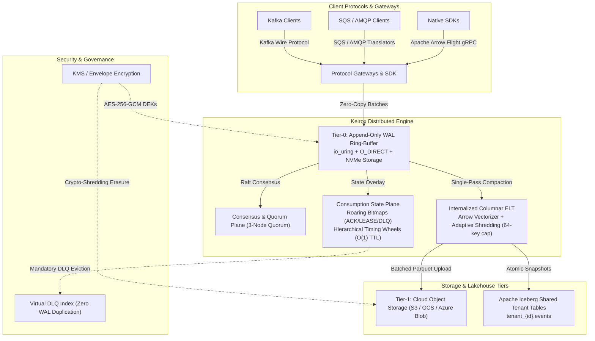

<div align="center">

# Keirox: The Polymorphic Event Fabric (PEF)

**Next-Generation Unified Distributed Streaming, Task Queuing, and Columnar Lakehouse Runtime**

[](LICENSE)
[](https://www.rust-lang.org/)
[](docs/)
[-blueviolet.svg)](docs/KEI-ARC-011.md)
[](docs/KEI-VAL-050.md)

</div>

---

## 🚀 Overview

**Keirox** is an open-source, high-performance distributed runtime implementing the **Polymorphic Event Fabric (PEF)**. 

Modern data architectures are burdened by fragmentation: engineering teams deploy separate broker clusters for **event streaming** (e.g., Apache Kafka), **message queuing / task distribution** (e.g., RabbitMQ, Amazon SQS), and **lakehouse ingestion pipelines** (e.g., Spark/Flink connectors writing to Apache Iceberg or Delta Lake). This causes massive operational overhead, infrastructure redundancy, dual-write bugs, and high egress costs.

Keirox eliminates this fragmentation by introducing a unified storage and state engine governed by the **Golden Invariant**:

> **$$\text{The Golden Invariant}$$**
> $$\text{Data is written exactly once to an immutable physical log.}$$
> $$\text{Consumption semantics (streaming, queuing, dead-lettering, lakehouse analytics) are defined}$$
> $$\text{entirely by the consumer's mutable, replicated state overlay.}$$



---

## ✨ Key Architectural Capabilities

### 1. Unified Ingress & NVMe Storage Engine
- **Kernel-Bypass I/O**: Direct NVMe disk appends using Linux `io_uring` and `O_DIRECT`, completely bypassing the OS page cache for deterministic $\le 2.0\text{ms}$ p99 ingress latency (under canonical Profile P1).
- **Static Registers & Packed Framing**: 64-byte aligned data structures (`SSTableChunkHeader`, `StateShardKey`, `Lease`) optimized for SIMD vectorization (AVX-512 / ARM Neon) and CPU cache-line efficiency.
- **Single-Pass Compaction**: Background worker pools transcode sealed physical WAL segments directly into columnar Parquet chunks without blocking the hot ingress path.

### 2. Consumption State Plane & Log-Bitmap Duality
- **Roaring Bitmaps**: 64-bit partitioned Roaring Bitmaps (`Roaring64Map`) project the immutable WAL into streaming, task-queue (`READY`, `LEASED`, `ACKED`, `EVICTED_DLQ`), and virtual DLQ states with minimal memory footprint.
- **Hierarchical Timing Wheels**: Sub-millisecond lease granting, renewals, and expiration timeouts with amortized $O(1)$ complexity over millions of concurrent in-flight leases.
- **Mandatory DLQ Eviction & Sliding Watermark**: Monotonic sliding base watermark ($W_{base}$) continuously purges state bits for terminal offsets. Offsets exceeding retry limits are evicted to a virtual DLQ index to guarantee watermark progression and prevent memory leaks.

### 3. Internalized Columnar ELT & Apache Iceberg Materialization
- **Adaptive Schema Shredding**: Dynamically tracks primitive field frequency and promotes stable fields into typed columnar Arrow vectors (capped at 64 primitive keys per stream namespace).
- **Polymorphic Safety**: Deeply nested, sparse, or conflicting polymorphic payloads gracefully route into compressed `_unstructured_payload` columns without failing ingress.
- **Continuous Iceberg Commits**: Aggregated 64–128 MB Parquet files are atomically registered into shared tenant Iceberg tables (`tenant_{id}.events`) with configurable freshness ($\le 60\text{s}$ default, $\le 5\text{s}$ fast mode).

### 4. Enterprise Security & Cryptographic Erasure
- **Envelope Encryption**: End-to-end data encryption at rest using AES-256-GCM with cloud KMS integration (AWS KMS, GCP Cloud KMS, Azure Key Vault, HashiCorp Vault).
- **Crypto-Shredding for GDPR / CCPA**: Instant, verifiable logical erasure by destroying per-stream Data Encryption Keys (DEKs). Physical ciphertext across the immutable WAL and lakehouse becomes cryptographically unrecoverable without rewriting storage logs.
- **Destroyed-Key Registry**: Replicated registry prevents accidental restoration of erased data across backups and cross-region replicas.

### 5. Multi-Region Replication & Disaster Recovery
- **Mode A Replication**: Single-writer primary with asynchronous replica regions, fenced by monotonic region epochs to eliminate split-brain write conflicts.
- **Causal Lineage & HLC**: Hybrid Logical Clocks and vector tags ensure causal ordering across geographic boundaries ($RPO \le 5\text{s}$, $RTO \le 1\text{min}$ planned failover).

### 6. Dual-Interface & Ecosystem Compatibility
- **Native Arrow Flight gRPC API**: High-efficiency client interface delivering zero-SerDe columnar records directly into client runtimes (Rust, Go, Python, Java, TypeScript).
- **Compatibility-by-Subset Gateways**: Certified drop-in compatibility for existing Apache Kafka, Amazon SQS, and AMQP 0-9-1 applications without requiring client rewrites.

---

## 📚 Complete Architecture Documentation Suite

The Keirox architecture is formally specified and verified across 25 comprehensive engineering documents in [`docs/`](docs/):

| Level | Document ID | Title | Summary |
|---|---|---|---|
| **Framework** | [`KEI-INDEX`](docs/INDEX.md) | Architecture Documentation Index & Routing Map | Single-entry architecture register, routing map, and precedence ladder. |
| **L0** | [`KEI-ARC-001`](docs/KEI-ARC-001.md) | Architecture Vision & System Context | System context, core problem statement, and unified fabric vision. |
| **L1** | [`KEI-ARC-010`](docs/KEI-ARC-010.md) | Conceptual Architecture & The Golden Invariant | Dual-plane separation, Log-Bitmap duality, and system boundaries. |
| **L1** | [`KEI-ARC-011`](docs/KEI-ARC-011.md) | Quality Attributes & NFRs | Concrete NFR catalog (PERF, DUR, AVAIL, SCALE, MEM, REC, SEC, COMP). |
| **L1** | [`KEI-ARC-012`](docs/KEI-ARC-012.md) | Architecture Principles & ADR Index | 38 binding Architecture Decision Records (ADRs) and governing principles. |
| **L2** | [`KEI-ARC-020`](docs/KEI-ARC-020.md) | Storage Engine Architecture | `io_uring` WAL ring buffer, Tier-0 NVMe, Tier-1 S3, single-pass compaction. |
| **L2** | [`KEI-ARC-021`](docs/KEI-ARC-021.md) | Consumption State Plane Architecture | Roaring Bitmap state transitions, lease management, virtual DLQ index. |
| **L2** | [`KEI-ARC-022`](docs/KEI-ARC-022.md) | Consensus, Coordination & HA Architecture | Multi-Raft quorum, deterministic coordinator sharding, epoch fencing. |
| **L2** | [`KEI-ARC-023`](docs/KEI-ARC-023.md) | Columnar ELT & Lakehouse Integration | Arrow vectorization, adaptive shredding, Parquet encoding, Iceberg integration. |
| **L2** | [`KEI-ARC-024`](docs/KEI-ARC-024.md) | Protocol Gateways & SDK Architecture | Native Arrow Flight gRPC, Kafka wire protocol, SQS/AMQP translation. |
| **L2** | [`KEI-ARC-025`](docs/KEI-ARC-025.md) | Security, Privacy & Compliance Architecture | AES-256-GCM envelope encryption, ABAC PDP, crypto-shredding, audit logs. |
| **L2** | [`KEI-ARC-026`](docs/KEI-ARC-026.md) | Multi-Region Replication & DR Architecture | Mode A WAN replication, HLC causal consistency, region failover. |
| **L2** | [`KEI-ARC-027`](docs/KEI-ARC-027.md) | Operability, Observability & Capacity Architecture | Metrics catalog, distributed tracing, backpressure ladder, rolling upgrades. |
| **L3** | [`KEI-DES-030`](docs/KEI-DES-030.md) | WAL Binary Framing & Storage Layout | 128-byte Batch Headers, 32-byte Record Entries, CRC32C, SIMD alignment. |
| **L3** | [`KEI-DES-031`](docs/KEI-DES-031.md) | State Plane Data Structures & Algorithms | `Roaring64Map`, Timing Wheel, watermark algorithms, lease journal binary format. |
| **L3** | [`KEI-DES-032`](docs/KEI-DES-032.md) | Producer/Consumer/Lease/ACK API Protocol | Protobuf RPC definitions, error taxonomy, idempotency keys. |
| **L3** | [`KEI-DES-033`](docs/KEI-DES-033.md) | Schema Registry & Adaptive Shredding | Schema inference scoring, field promotion/demotion, `_unstructured_payload`. |
| **L3** | [`KEI-DES-034`](docs/KEI-DES-034.md) | Iceberg Catalog Committer Specification | Atomic catalog commit protocol, commit ledger, snapshot lifecycle, orphan cleanup. |
| **L3** | [`KEI-DES-035`](docs/KEI-DES-035.md) | Gateway Wire-Protocol Compatibility Matrices | S0–S3 support tiers for Kafka, SQS, and AMQP protocols. |
| **L3** | [`KEI-DES-036`](docs/KEI-DES-036.md) | Encryption, Key Management & Crypto-Shredding | KMS adapters, DEK lifecycle, Destroyed-Key Registry, erasure workflow. |
| **OPS** | [`KEI-OPS-040`](docs/KEI-OPS-040.md) | Operations Runbooks, Upgrade & DR Procedures | 20 operational runbooks, rolling upgrades, DR failover, incident response. |
| **OPS** | [`KEI-OPS-041`](docs/KEI-OPS-041.md) | Validation, Benchmark & Chaos Test Plan | Canonical workload profiles (P1–P6), Jepsen test suite, release certification gates. |
| **VAL** | [`KEI-VAL-050`](docs/KEI-VAL-050.md) | Final Cross-Document Consistency Audit | Independent audit certifying zero contradictions and 100% NFR traceability. |
| **VAL** | [`KEI-VAL-051`](docs/KEI-VAL-051.md) | Requirements Traceability Matrix (RTM) | 113 requirements mapped end-to-end to design, operations, and tests. |
| **VAL** | [`KEI-VAL-052`](docs/KEI-VAL-052.md) | Release Readiness Checklist | Executive 5-gate certification checklist for Phase-1 engineering execution. |

---

## 🛠️ Getting Started

### Prerequisites
- **Rust**: Version 1.78+ (Stable / Nightly for AVX-512 intrinsics).
- **Operating System**: Linux kernel 5.10+ recommended (for `io_uring` + `O_DIRECT`).

### Building from Source
```bash
# Clone repository
git clone https://github.com/keirox-labs/keirox.git
cd keirox

# Run code format and linter checks
cargo fmt --all -- --check
cargo clippy --all-targets --all-features -- -D warnings

# Execute test suite
cargo test --all
```

---

## 🤝 Contributing

We welcome contributions from the community! Keirox is an open-source project that thrives on rigorous systems engineering, transparent collaboration, and empirical validation.

- Please read our [**Contributing Guide**](CONTRIBUTING.md) for details on code standards, hot-path memory hygiene, and pull request workflows.
- All participants must abide by our [**Code of Conduct**](CODE_OF_CONDUCT.md).
- To propose architectural changes, please submit an ADR proposal aligned with [`docs/KEI-ARC-012.md`](docs/KEI-ARC-012.md).

---

## 📄 License

Keirox is distributed under the terms of the **[Apache License 2.0](LICENSE)**.

```
Copyright 2026 Keirox Authors & Contributors

Licensed under the Apache License, Version 2.0 (the "License");
you may not use this file except in compliance with the License.
You may obtain a copy of the License at

    http://www.apache.org/licenses/LICENSE-2.0

Unless required by applicable law or agreed to in writing, software
distributed under the License is distributed on an "AS IS" BASIS,
WITHOUT WARRANTIES OR CONDITIONS OF ANY KIND, either express or implied.
See the License for the specific language governing permissions and
limitations under the License.
```
